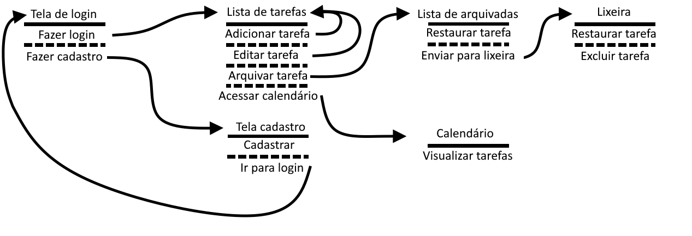
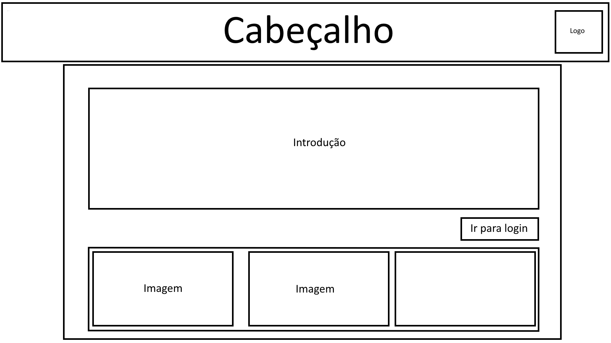
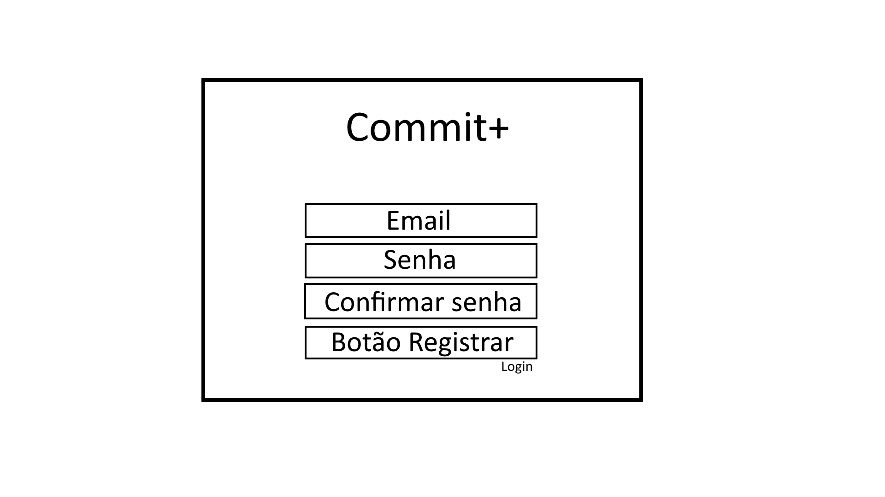
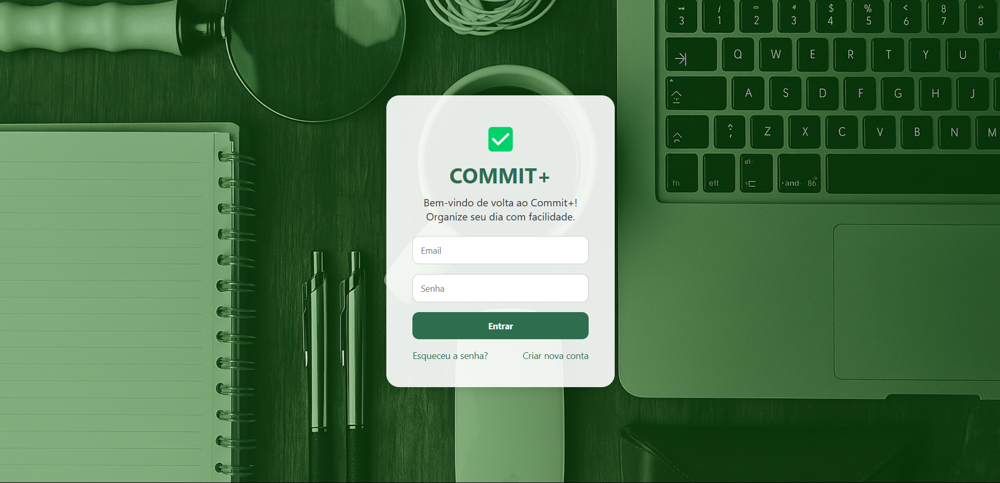
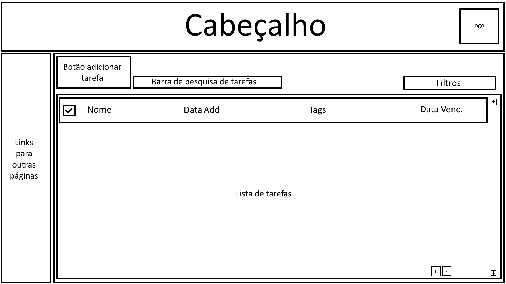
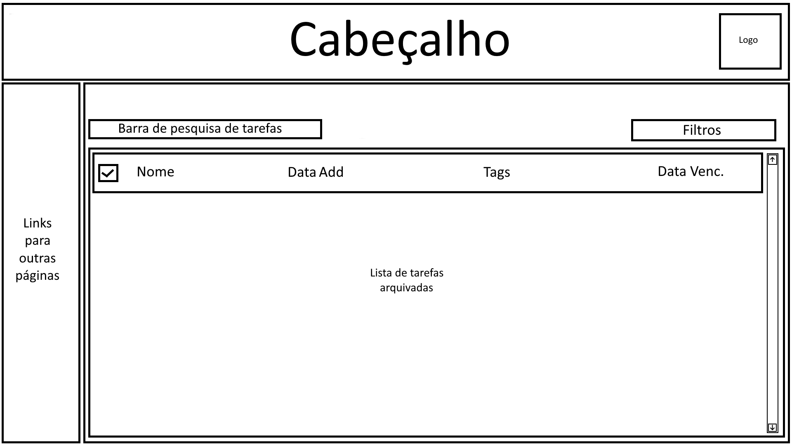
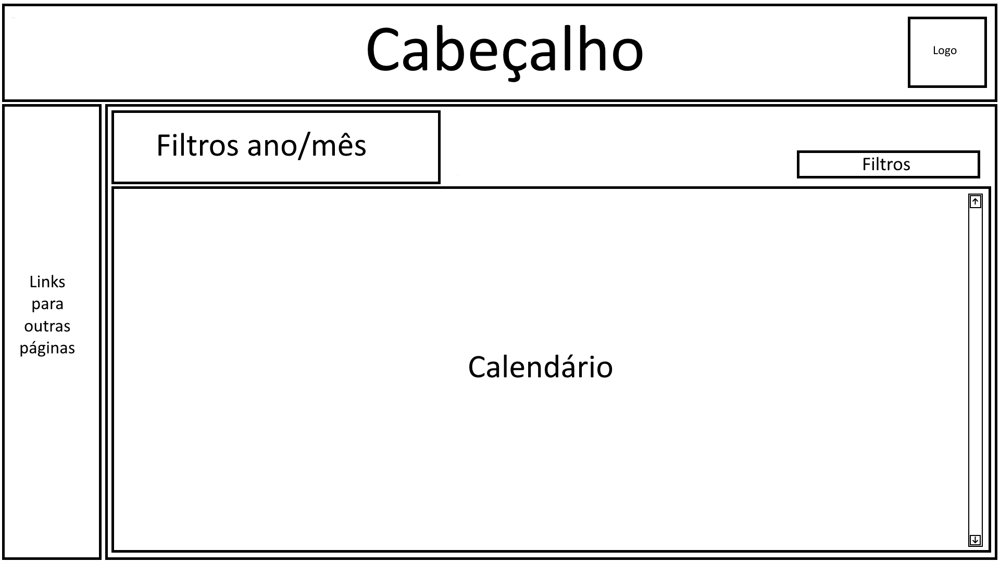

# Projeto de Interface

Visão geral da interação do usuário pelas telas do sistema e protótipo interativo das telas com as funcionalidades que fazem parte do sistema (wireframes).

## User Flow

Fluxo de usuário (User Flow) é uma técnica que permite ao desenvolvedor mapear todo fluxo de telas do site ou app. Essa técnica funciona para alinhar os caminhos e as possíveis ações que o usuário pode fazer junto com os membros de sua equipe.

## Wireframes Commit+

O wireframe seguinte é um protótipo não muito fiel ao projeto, porém mostra os itens que aparecerão após o usuário fazer o login no gerenciador de tarefas. O cabeçalho apresenta um local fixo reservado para a cor a ser definida e também onde ficará a logo. O conteúdo mudará conforme requisitado pelo usuário ao navegar pelas opções. A barra lateral conta com os ícones que direcionarão para cada tela após serem clicados, assim mudando o conteúdo da página.

