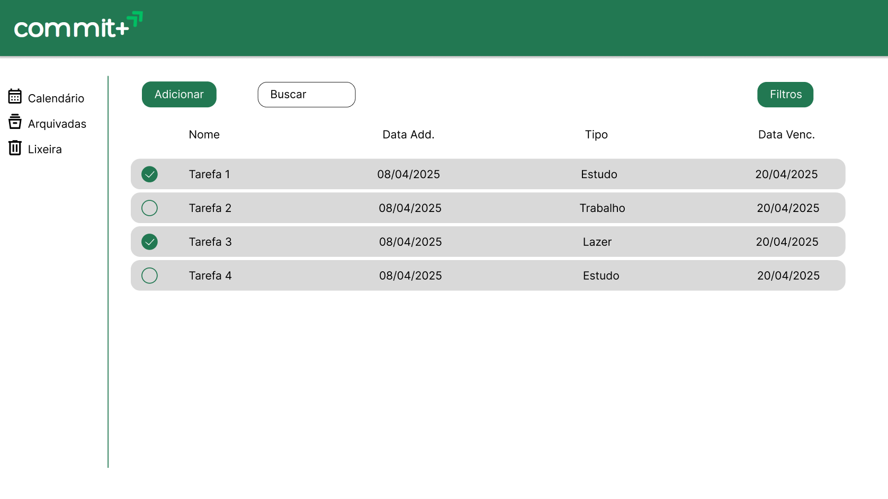

# Template padrão do site

Layout padrão do site (HTML e CSS) que será utilizado em todas as páginas com a definição de identidade visual, aspectos de responsividade e iconografia.

## Design

Tela de login:   

  Tela de lista de tarefas:   

## Cores

Paleta de cores: #2E7D32 #4CAF50 #81C784 #C8E6C9 #F1F8F4  

## Tipografia
Usaremos a fonte Roboto:
  

## Iconografia
Usaremos os ícones do Google Fonts:
  

